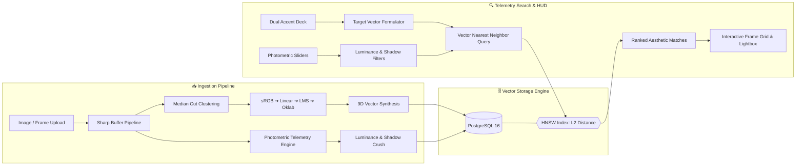

# 🎬 FRAME HUNTER

### Perceptual Video & Cinematography Telemetry Search Engine

 

  <b>Search video sequences, films, and photography by perceptual color vectors and photometric curves.</b> 
  Sub-millisecond visual DNA retrieval powered by median cut clustering, LMS cone response telemetry, and PostgreSQL HNSW vector indexing.

---

## 📑 Highlights

- 🎨 **Perceptually Uniform Oklab Vectors** — 9D vectors capturing 3 weighted dominant color centroids ordered by visual presence.
- ☀️ **Photometric Telemetry** — Automatic measurement of ITU-R BT.709 relative luminance and shadow crush ratio.
- ⚡ **Sub-Millisecond Retrieval** — High-performance Hierarchical Navigable Small World (HNSW) vector search in PostgreSQL.
- 🎛 **Interactive Control Deck** — Real-time dual color pickers with cinema presets (*Cyberpunk*, *Teal & Orange*, *Golden Hour*, *Neo-Noir*, *Matrix Acid*).
- 🔬 **Instant Visual DNA Matching** — Match any shot's exact color profile with one click.
- 🖥 **High-Res Lightbox HUD** — Full-screen inspection modal with live photometric readouts and color harmonies.

---

## 🏛 System Architecture

---

## 🧪 The Science: Perceptual Color & Exposure

| Pipeline Stage | Scientific Foundation | Real-World Cinematographic Purpose |
| :--- | :--- | :--- |
| **Linearization** | Reverse sRGB gamma curve expansion | Removes monitor transfer compression to compute optical energy. |
| **LMS Cone Fundamentals** | Hunt-Pointer-Estevez cone photoreceptors | Simulates human retinal response across long, medium, and short wavelengths. |
| **Oklab Coordinates** | Opponent lightness ($L$) and chromatic axes ($a, b$) | Ensures equal Euclidean distances reflect equal perceptual differences ($\Delta E$). |
| **Median Cut Clustering** | 3D RGB bounding box spatial partitioning | Extracts dominant pigment masses and calculates pixel weight distributions. |
| **BT.709 Relative Luminance** | $Y = 0.2126R + 0.7152G + 0.0722B$ | Measures perceived scene exposure matching modern broadcast standards. |
| **Shadow Crush Ratio** | Sub-threshold pixel ratio ($Y < 0.15$) | Detects moody film noir, high contrast, and crushed blacks. |

---

## 🎛 Interface & Controls

| Module | Purpose | Controls & Capabilities |
| :--- | :--- | :--- |
| **Dual Color Deck** | Color Harmony Formulation | Dual interactive color wheels, live HEX displays, and one-click cinematic palettes. |
| **Photometric Sliders** | Dynamic Mood Gating | **Max Brightness** slider (Midnight Noir to High Noon) & **Min Shadow Crush** slider (Flat to Crushed). |
| **Workspace Selector** | Dual Library Organization | Toggle between **Reference Archive** (sample stills) and **Custom Curation** (user uploads). |
| **Aesthetic Strip** | Harmonic Proportions | 3-swatch weighted strip under each card. Click any tone to load it directly into your search deck. |
| **Match This Shot** | Instant Style Matching | Overlays on each frame to search the entire library for identical color DNA in milliseconds. |
| **Full-Res Lightbox** | Uncropped Visual Inspection | Full-screen modal with aspect ratio badge, ΔE distance readout, and detailed photometric HUD. |

---

## 📊 Telemetry Vector Layout

Each ingested frame is represented by an immutable 9-dimensional vector in Oklab space:

$$\mathbf{V}_{\text{palette}} = \begin{bmatrix} L_1 & a_1 & b_1 & L_2 & a_2 & b_2 & L_3 & a_3 & b_3 \end{bmatrix}$$

- **$L_1, a_1, b_1$**: Primary dominant color centroid (largest pixel weight).
- **$L_2, a_2, b_2$**: Secondary harmonic tone (second largest pixel weight).
- **$L_3, a_3, b_3$**: Tertiary background / ambient tone.

Vector distance is computed using the **$L_2$ Euclidean metric** over an **HNSW** graph structure for near-instant response times.

---

## 🛠 Tech Stack Matrix

- **Backend Runtime**: Node.js & TypeScript
- **Server Framework**: Fastify
- **Image Pipeline**: Sharp (libvips)
- **Vector Database**: PostgreSQL 16 with pgvector extension
- **Frontend Framework**: Next.js 14 (App Router)
- **Styling**: Tailwind CSS & Vanilla CSS (Custom dark theme `#090a0f`)
- **Icons**: Lucide Icons
- **Containerization**: Docker Compose

---

## 🚀 Quickstart Guide

### 1. Launch Database
Start the PostgreSQL container with pgvector:
- `docker-compose up -d`

### 2. Launch Backend API
Start the Fastify telemetry service:
- Navigate to `backend/`
- Install dependencies: `npm install`
- Start development server: `npm run dev` *(Listening on port 5000)*

### 3. Launch Frontend UI
Start the Next.js control deck:
- Navigate to `frontend/`
- Install dependencies: `npm install`
- Start development server: `npm run dev` *(Listening on port 3000)*

---

## 📄 License

Distributed under the MIT License. See [LICENSE](LICENSE) for full details.
