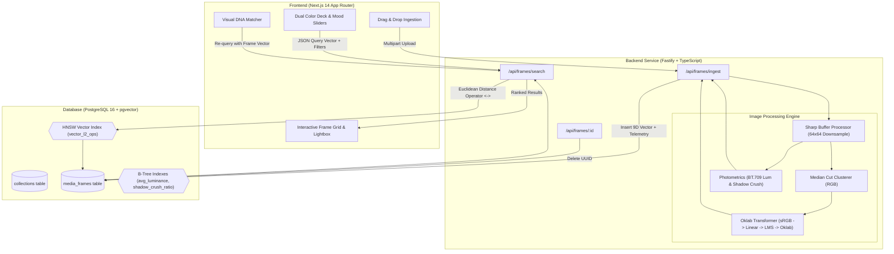

<div align="center">

# 🎬 FRAME HUNTER

### Perceptual Video & Still Telemetry Search Engine

[](https://www.typescriptlang.org/)
[](https://nextjs.org/)
[](https://fastify.dev/)
[](https://www.postgresql.org/)
[](https://github.com/pgvector/pgvector)
[](https://tailwindcss.com/)
[](https://opensource.org/licenses/MIT)

<p align="center">
  <b>Search video sequences and cinematography via raw perceptual color vectors (Oklab) and photometric curves.</b><br>
  Sub-millisecond visual DNA retrieval powered by median cut clustering, LMS cone response telemetry, and PostgreSQL HNSW vector indexing.
</p>

---

</div>

## 📑 Table of Contents

- [Overview](#-overview)
- [System Architecture](#-system-architecture)
- [Mathematical & Color Pipeline](#-mathematical--color-pipeline)
  - [1. Non-linear sRGB to Linear RGB](#1-non-linear-srgb-to-linear-rgb)
  - [2. Linear RGB to LMS Cone Fundamentals](#2-linear-rgb-to-lms-cone-fundamentals)
  - [3. LMS to Perceptually Uniform Oklab Space](#3-lms-to-perceptually-uniform-oklab-space)
  - [4. Median Cut Quantization & 9D Palette Vector](#4-median-cut-quantization--9d-palette-vector)
  - [5. Photometric Luminance & Shadow Crush Curves](#5-photometric-luminance--shadow-crush-curves)
- [Database Schema & HNSW Indexing](#-database-schema--hnsw-indexing)
- [Key Features & UI Deck](#-key-features--ui-deck)
- [API Reference](#-api-reference)
- [Directory Structure](#-directory-structure)
- [Local Setup & Deployment](#-local-setup--deployment)
- [License](#-license)

---

## 🔬 Overview

Traditional media taggers rely on semantic keywords (e.g. *"dark room"*, *"sunset"*), missing the nuanced technical art of color grading, lighting ratios, and tonal curves.

**FrameHunter** treats every video frame and photograph as a **multidimensional geometric signal**:
1. **Perceptual Uniformity**: Computes dominant palettes in **Oklab** color space where Euclidean distance ($\Delta E$) matches human visual perception far better than sRGB or CIELAB.
2. **Photometric Telemetry**: Quantifies exposure characteristics including average BT.709 relative luminance and shadow crush ratio.
3. **High-Dimensional Vector Search**: Embeds 3 primary weighted centroids into a **9-dimensional vector** indexed via PostgreSQL's **HNSW** graph algorithm ($m=16, ef_{construction}=64$) for real-time nearest-neighbor retrieval.

---

## 🏗 System Architecture



---

## 📐 Mathematical & Color Pipeline

### 1. Non-linear sRGB to Linear RGB
Standard sRGB components ($C \in [0, 255]$) incorporate non-linear gamma compression. Before optical calculation, channels are linearized:

$$
C_{\text{lin}} = \begin{cases} 
\frac{C / 255}{12.92}, & \text{if } \frac{C}{255} \le 0.04045 \\ 
\left(\frac{C / 255 + 0.055}{1.055}\right)^{2.4}, & \text{otherwise} 
\end{cases}
$$

### 2. Linear RGB to LMS Cone Fundamentals
Linear RGB is transformed into long ($L$), medium ($M$), and short ($S$) cone responses modeling human retina photoreceptors:

$$
\begin{bmatrix} L \\ M \\ S \end{bmatrix} = \begin{bmatrix}
0.4122214708 & 0.5363325363 & 0.0514459929 \\
0.2119034982 & 0.6806995451 & 0.1073969566 \\
0.0883024619 & 0.2817188376 & 0.6299787005
\end{bmatrix} \begin{bmatrix} R_{\text{lin}} \\ G_{\text{lin}} \\ B_{\text{lin}} \end{bmatrix}
$$

A non-linear cube root activation is applied:

$$
l = \sqrt[3]{L}, \quad m = \sqrt[3]{M}, \quad s = \sqrt[3]{S}
$$

### 3. LMS to Perceptually Uniform Oklab Space
The compressed cone responses are projected onto the Cartesian Oklab coordinates:
- $L$: Perceived lightness ($0.0 \to 1.0$)
- $a$: Green $(-)$ to Red $(+)$ opponent axis
- $b$: Blue $(-)$ to Yellow $(+)$ opponent axis

$$
\begin{bmatrix} L \\ a \\ b \end{bmatrix} = \begin{bmatrix}
0.2104542553 & 0.7936177850 & -0.0040720468 \\
1.9779984951 & -2.4285922050 & 0.4505937099 \\
0.0259040371 & 0.7827717662 & -0.8086757660
\end{bmatrix} \begin{bmatrix} l \\ m \\ s \end{bmatrix}
$$

### 4. Median Cut Quantization & 9D Palette Vector
- The input frame buffer is downsampled to **64x64 raw RGB pixels** to enable sub-10ms clustering.
- **Median Cut Algorithm** iteratively bisects color bounding boxes along their widest channel spread until 3 tight bounding clusters are isolated.
- Clusters are weighted by pixel frequency ($w_1 \ge w_2 \ge w_3$) and transformed into Oklab space:

$$\mathbf{v}_{\text{palette}} = \begin{bmatrix} L_1 & a_1 & b_1 & L_2 & a_2 & b_2 & L_3 & a_3 & b_3 \end{bmatrix} \in \mathbb{R}^9$$

### 5. Photometric Luminance & Shadow Crush Curves
- **Average Relative Luminance** (ITU-R BT.709):
  
  $$Y = \frac{1}{N}\sum_{i=1}^{N} \frac{0.2126 \cdot R_i + 0.7152 \cdot G_i + 0.0722 \cdot B_i}{255.0}$$

- **Shadow Crush Ratio**: The fraction of image pixels falling below the toe threshold ($Y < 0.15$), identifying contrast-heavy, crushed-black cinematography (film noir, chiaroscuro):

  $$\text{Crush Ratio} = \frac{1}{N}\sum_{i=1}^{N} \mathbf{1}_{\{Y_i < 0.15\}}$$

---

## 🗄 Database Schema & HNSW Indexing

```sql
-- 1. Enable pgvector
CREATE EXTENSION IF NOT EXISTS vector;

-- 2. Projects & Collections Table
CREATE TABLE IF NOT EXISTS collections (
    id UUID PRIMARY KEY DEFAULT gen_random_uuid(),
    title VARCHAR(120) NOT NULL,
    description TEXT,
    created_at TIMESTAMPTZ DEFAULT NOW()
);

-- 3. Media Frames & Aesthetic Telemetry
CREATE TABLE IF NOT EXISTS media_frames (
    id UUID PRIMARY KEY DEFAULT gen_random_uuid(),
    collection_id UUID REFERENCES collections(id) ON DELETE CASCADE,
    file_name VARCHAR(255) NOT NULL,
    storage_url TEXT NOT NULL,
    timestamp_sec NUMERIC(8, 2),
    aspect_ratio NUMERIC(4, 2) NOT NULL,
    
    -- Photometrics
    avg_luminance REAL NOT NULL CHECK (avg_luminance BETWEEN 0.0 AND 1.0),
    shadow_crush_ratio REAL NOT NULL CHECK (shadow_crush_ratio BETWEEN 0.0 AND 1.0),
    
    -- Aesthetic Vector: 3 dominant centroids in Oklab space
    color_palette vector(9) NOT NULL,
    dominant_clusters JSONB,
    is_sample BOOLEAN DEFAULT FALSE,
    
    created_at TIMESTAMPTZ DEFAULT NOW()
);

-- 4. HNSW Vector Indexing for L2 Euclidean Distance
CREATE INDEX IF NOT EXISTS idx_frames_color_hnsw 
    ON media_frames USING hnsw (color_palette vector_l2_ops)
    WITH (m = 16, ef_construction = 64);

-- 5. Compound Photometric Index
CREATE INDEX IF NOT EXISTS idx_frames_mood 
    ON media_frames (avg_luminance, shadow_crush_ratio);
```

---

## 🎛 Key Features & UI Deck

| Component | Feature | Details |
|---|---|---|
| **Dual Color Deck** | Dominant Harmonies | Pick primary & secondary hex values with built-in filmic presets (*Cyberpunk*, *Teal & Orange*, *Golden Hour*, *Neo-Noir*, *Matrix Acid*). |
| **Photometric Sliders** | Exposure & Shadow Gates | Dual range sliders controlling **Max Brightness** and **Min Shadow Crush** to filter high-key vs. low-key frames. |
| **Workspace Modes** | Reference vs. Curation | Switch between the **Reference Archive** (`is_sample = true`) and your own **Custom Curation** workspace. |
| **Visual DNA Match** | One-Click Shot Match | Hovering any frame card provides **"Match This Shot"**, immediately re-querying the database using that frame's exact 9D vector. |
| **Interactive Palette Strip** | Weight-Scaled Swatches | Each frame displays a 3-segment color strip proportional to cluster mass. Click any swatch to load that tone into your query deck. |
| **High-Res Lightbox** | Uncropped Modal HUD | Full-screen presentation preserving natural aspect ratios with telemetry stats, ΔE distance badge, and ESC/backdrop dismissal. |

---

## 🔌 API Reference

### 1. Ingest Frame
```http
POST /api/frames/ingest
Content-Type: multipart/form-data
```
**Body:**
- `file`: Image binary (`jpg`, `png`, `webp`)
- `is_sample` (optional): `'true'` | `'false'`

**Response (`201 Created`):**
```json
{
  "success": true,
  "frame": {
    "id": "c1f7df2b-5e93-4a62-95f0-e5550c60daef",
    "file_name": "blade_runner_2049.png",
    "aspect_ratio": 2.39,
    "avg_luminance": 0.3214,
    "shadow_crush_ratio": 0.4512,
    "dominant_clusters": [
      { "rgb": { "r": 15, "g": 210, "b": 230 }, "oklab": { "L": 0.72, "a": -0.15, "b": -0.12 }, "weight": 0.54 }
    ],
    "is_sample": false
  }
}
```

---

### 2. Search Frames by Vector
```http
POST /api/frames/search
Content-Type: application/json
```
**Request Body:**
```json
{
  "targetPalette": [0.63, -0.07, -0.09, 0.45, 0.12, 0.08, 0.22, -0.02, -0.04],
  "minShadowCrush": 0.10,
  "maxShadowCrush": 1.00,
  "minLuminance": 0.00,
  "maxLuminance": 0.85,
  "limit": 24,
  "isSample": false
}
```
**Response (`200 OK`):**
```json
{
  "total": 12,
  "results": [
    {
      "id": "c1f7df2b-5e93-4a62-95f0-e5550c60daef",
      "file_name": "blade_runner_2049.png",
      "storage_url": "data:image/png;base64,...",
      "aspect_ratio": 2.39,
      "avg_luminance": 0.3214,
      "shadow_crush_ratio": 0.4512,
      "aesthetic_distance": 0.0418,
      "raw_vector": "[0.6321,-0.0781,-0.0984,...]"
    }
  ]
}
```

---

### 3. Delete Frame
```http
DELETE /api/frames/:id
```
**Response (`200 OK`):**
```json
{
  "success": true,
  "deletedId": "c1f7df2b-5e93-4a62-95f0-e5550c60daef"
}
```

---

## 📂 Directory Structure

```
frame-hunter/
├── docker-compose.yml              # PostgreSQL 16 + pgvector container definition
├── .gitignore                      # Exhaustive security & build exclusions
├── .env.example                    # Global environment template
├── README.md                       # Documentation
│
├── backend/
│   ├── .env.example
│   ├── package.json
│   ├── tsconfig.json
│   ├── migrations/
│   │   └── 001_init_schema.sql     # pgvector extension, schema, and HNSW indexes
│   └── src/
│       ├── server.ts               # Fastify HTTP server initialization
│       ├── test-engine.ts          # Core math & pipeline smoke tests
│       ├── config/
│       │   └── db.ts               # PostgreSQL connection pool & auto-migration
│       ├── core/
│       │   ├── bufferProcessor.ts  # Sharp pipeline & cluster extraction
│       │   ├── colorQuantizer.ts   # 3D RGB median-cut color box clustering
│       │   ├── colorSpace.ts       # Non-linear sRGB -> Linear -> LMS -> Oklab
│       │   └── telemetry.ts        # Photometric BT.709 & shadow crush formulas
│       ├── routes/
│       │   ├── ingest.route.ts     # Frame upload, telemetry extract, pgvector insert
│       │   └── search.route.ts     # L2 distance HNSW queries with mood gating
│       └── types/
│           └── index.ts            # Shared backend interfaces
│
└── frontend/
    ├── .env.example
    ├── package.json
    ├── tsconfig.json
    ├── next.config.mjs
    ├── tailwind.config.ts          # Aesthetic dark surface tokens (#090a0f, #12141c)
    ├── postcss.config.mjs
    └── src/
        ├── app/
        │   ├── globals.css         # Dark deck styling & custom scrollbars
        │   ├── layout.tsx          # Root layout & SEO metadata
        │   └── page.tsx            # Main dashboard with dual workspace control
        ├── components/
        │   ├── DualColorPicker.tsx # Accent pickers & cinematic harmony pills
        │   ├── MoodSliders.tsx     # Luminance & shadow crush telemetry sliders
        │   ├── InspoDropzone.tsx   # Drag-and-drop frame upload to ingestion
        │   └── FrameCard.tsx       # Frame display, ΔE badge, palette bar & modal
        ├── lib/
        │   ├── api.ts              # Fetch client for search, upload, and delete
        │   └── colorUtils.ts       # Frontend hex/RGB/Oklab vector synthesis
        └── types/
            └── index.ts            # Frontend client types
```

---

## 🚀 Local Setup & Deployment

### Prerequisites
- [Docker & Docker Compose](https://www.docker.com/)
- [Node.js (v20+)](https://nodejs.org/)
- `npm` or `pnpm`

### 1. Clone Repository
```bash
git clone https://github.com/sayakbhattasali/frame-hunter.git
cd frame-hunter
```

### 2. Start PostgreSQL with pgvector
```bash
docker-compose up -d
```

### 3. Setup & Start Backend
```bash
cd backend
cp .env.example .env
npm install
npm run dev
```
*Backend runs on `http://localhost:5000`.*

### 4. Setup & Start Frontend
```bash
cd ../frontend
cp .env.example .env.local
npm install
npm run dev
```
*Frontend runs on `http://localhost:3000`.*

---

## 📜 License

Distributed under the MIT License. See [LICENSE](LICENSE) for details.
